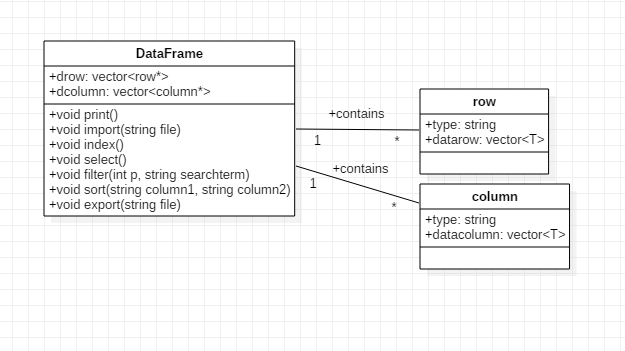

Algoritmos y Estructuras de Datos
================================

Trabajo Final
-------------

### Equipo de Trabajo
* Mazzarri, Carlos
* Leyva, Alonso
* Suzuki, Hector

### Introducción

El problema radica en que el lenguaje de programación C++ no posee una biblioteca que contenga la implementación del tipo de dato abstracto Data Frame, y por lo tanto no se puede realizar una manipulación de datos con indexación, como lo hace la biblioteca _pandas_ del lenguaje Python. Por lo tanto, la solución propuesta es el desarrollo de una biblioteca que permita lo mencionado para el lenguaje C++. Esta solución incluye la implementación de funcionalidades como importación de datos, indexado, selección, filtrado (en base a diversos criterios) y ordenamiento de datos por columnas, además de exportación de estos datos archivos planos. Este proyecto se desarrollará considerando el ámbito de programación orientada a objetos (POO), y se utilizará la plataforma _GitHub_ para la gestión de versiones.

### Objetivos

_Objetivo general_

Nuestro objetivo general en este proyecto es crear una biblioteca en Visual Studio, en el lenguaje C++, que permita el uso de data frames. Usaremos toda la teoría y conocimiento obtenido durante el curso, y usando como referencia los “panda data frames” del lenguaje de programación Python, para poder crear funciones de manera más eficiente.

_Objetivos específicos: analizar, diseñar, desarrollar solución._

- Definir el marco conceptual de dataframe y árboles binarios.
- Interpretar los conceptos investigados aplicados a nuestro proyecto.
- Desarrollar las funcionalidades de pandas en C++ utilizando las estructuras investigadas previamente como referencia.
- Inspeccionar el funcionamiento correcto de los módulos solicitados por el proyecto.
- Demostrar la gestión de datos eficiente por nuestro programa.
- Proponer mejoras funcionales y optimizaciones a nuestro código. 

### Marco Conceptual

**Data frame:**
Un “Data frame” es una tabla, o una estructura con forma de un arreglo bidimensional, en que cada columna contiene medidas en una variable, y cada fila contiene un caso. Un “caso” no necesariamente es igual como un objeto experimental o unidad, aunque a veces son lo mismo. 

En el lenguaje de programación R, un data frame es una lista de “vectores columna”. A diferencia de un arreglo, la data que guardas en las columnas de un data frame puede ser de varios tipos. Por ejemplo, una columna puede ser una variable numérica, otra puede ser un carácter variable y una tercera podría ser un elemento cualquiera. Todas las columnas tienen que poseer el mismo tamaño. King, W(2016)1

**Árbol binario:**
Los árboles binarios son estructuras que poseen una gran cantidad de ventajas a la hora de programar. En lo referente a este término, Aguilar (2007) indica lo siguiente:

>“El árbol es una estructura de datos muy importante en informática y en ciencias de     la computación. Los árboles son estructuras no    lineales, al contrario que los arrays     y las listas enlazadas que constituyen estructuras lineales. La estructura de datos            árbol    generaliza las estructuras lineales vistas en capítulos anteriores. Los árboles se utilizan para representar fórmulas          algebraicas, para   organizar objetos en orden de tal forma que las búsquedas son muy eficientes, y en aplicaciones diversas tales      como inteligencia    artificial o algoritmos de cifrado. Casi todos los sistemas operativos almacenan sus archivos en árboles o          estructuras similares a    árboles. Además de las aplicaciones citadas, los árboles se utilizan en diseño de compiladores, proceso de    texto y algoritmos de    búsqueda.” (p. 489)

Adicionalmente, Weiss (2014) indica que un árbol binario es aquel árbol en el que ninguno de sus nodos puede tener más de dos hijos. Una de las propiedades importantes de estos árboles es que la altura de un árbol promedio es mucho menor que su número de nodos (N). La altura promedio de un árbol binario es de orden O(√N), y para un tipo de árbol binario especial llamado árbol binario de búsqueda (ABB), el orden promedio de la altura es O (log N). Sin embargo, existe la posibilidad de que la altura sea N-1, el peor caso en un árbol binario.3

3 "A binary tree is a tree in which no node can have more than two children. (...)
A property of a binary tree that is sometimes important is that the depth of an average
binary tree is considerably smaller than N. (...) The average depth is
O(√N), and that for a special type of binary tree, namely the binary search tree, the average
value of the depth is O(log N). Unfortunately, the depth can be as large as N − 1. (...)" (Weiss, 2014, p. 126).

### Diagrama de clases (alto nivel)

### Cronograma de trabajo

- Milestone1:
  - Crear repo
  - Crear proyecto
  - Editar informe
    - Intro
    - Objetivos
    - Marco Conceptual
    - Diagrama de clase
    - Cronograma
- Milestone2:
  - Implementación de clases
    - Designar dependencias
    - Asignar clases
    - Implementar clase N
  - Diseño de UI
  - Diseño de TDA N (tipo de dato abstracto)
    - biotree
    - hashtable
    - pila
  - Diagrama de componentes
  - Diagrama de clases (bajo nivel)
  
### Referencias Bibliográficas

1 King, W. (2016) Recuperado de http://ww2.coastal.edu/kingw/statistics/R-tutorials/dataframes.html [Consulta: 5 de junio de 2019]

2 Aguilar, J. _Estructura de datos en C++_ (2007) Recuperado de http://subdesarrollando.com.ar/wp-content/uploads/2015/10/Estructura.de_.datos_.en_.C.Joyanes.pdf [Consulta: 5 de junio de 2019]

3 Weiss, M. (2014) _Data Structures and Algorithm Analysis in C++_ Recuperado de http://iips.icci.edu.iq/images/exam/DataStructuresAndAlgorithmAnalysisInCpp_2014.pdf [Consulta: 5 de junio de 2019]

